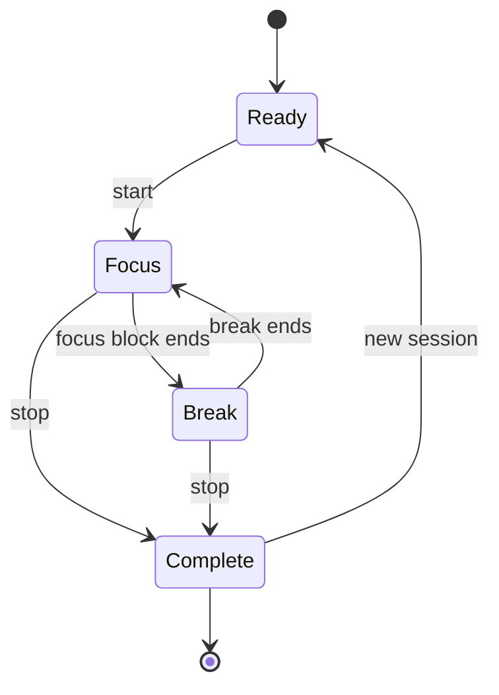

# 🐼 goPanda

> **A cute, lightweight Pomodoro timer and productivity companion.**

`goPanda` is a small productivity app built around one job: **help you start focused work without turning productivity into another complicated system.**

It belongs to the lightweight/public-tool side of the **.dot** ecosystem.

## 🔄 Focus Loop



**How to read it:** goPanda intentionally has a tiny state machine. A session is either ready, focused, on a break, or complete; the product stays out of the user's way.

## What It Does

- ⏱️ **Pomodoro-focused workflow** for timed work and breaks.
- 🐼 **Friendly companion experience** designed to make starting a session feel approachable.
- 🖥️ **Desktop-capable application** with Tauri support alongside the browser experience.
- ⚡ **Fast local-first interaction** with a deliberately lightweight UI.
- ✨ **Motion and micro-interactions** without sacrificing the utility of the timer.
- 🤖 **AI-ready architecture** using the Google GenAI SDK where intelligent features are introduced.

The product is intentionally smaller than .dot's flagship platforms. **goPanda is a tool, not a platform.**

## 🧭 Design Philosophy

```text
Choose a focus block
        ↓
      Work
        ↓
     Break
        ↓
   Repeat / Stop
```

No complicated productivity methodology is required. The goal is to provide a pleasant focus loop that gets out of the way.

## 🛠️ Tech Stack

| Layer | Technology |
|---|---|
| UI | React 19, TypeScript |
| Build | Vite |
| Styling | Tailwind CSS |
| Motion | Motion |
| Icons | Lucide React |
| Desktop | Tauri 2 |
| Server/runtime utilities | Node.js / Express |
| AI integration | Google GenAI SDK |

## 🚀 Run Locally

```bash
git clone https://github.com/cser-utkarsh-raj/goPanda.git
cd goPanda
npm install
npm run dev
```

The Vite development server uses port `3000`.

```bash
npm run build
npm run preview
npm run tauri:build
npm run lint
```

## 📂 Project Direction

goPanda is designed to remain **small, fast, friendly, and easy to iterate on**. It can grow with useful productivity features, but it should not become a bloated task-management suite.

That constraint is part of the product identity.

## 🌐 Part of .dot

`.dot` is the umbrella behind a collection of products and experiments — from flagship platforms such as Sailor and myMentor to infrastructure such as dotRoute and lightweight public tools such as goPanda and NailedIt.

> **goPanda · Focus, one block at a time.**
>
> **Presented by .dot**
